# Hortobots Planning

Plataforma de Diário de Bordo Digital e Gestão Técnica para as equipes SESI Hortobots FLL, Under Construction FLL e Hortobots OBR do SESI 437 - Hortolândia.

O projeto opera como um monorepo modular em TypeScript. O backend em Node.js com Express e arquitetura hibrida gerencia as requisicoes da API e serve a Single Page Application (SPA) compilada em React + Vite.

---

## 1. Visao Geral e Arquitetura

O sistema adota o padrao de persistencia hibrida com desacoplamento de infraestrutura:

- **Modo Nuvem (Render + Supabase):**
  - Hospedagem no Render via Blueprint (`render.yaml`).
  - Persistencia relacional no PostgreSQL do Supabase (`records`, `events`, `tests`).
  - Armazenamento de arquivos e midias em Supabase Storage.
  - Ativado automaticamente com `STORAGE_DRIVER=supabase`.

- **Modo Local (Simulacao de Desenvolvimento):**
  - Persistencia orientada a arquivos JSON e midias locais na pasta `Logs/` (`registros`, `testes`, `eventos`).
  - Execucao agil sem necessidade de conexao externa ativa.
  - Ativado com `STORAGE_DRIVER=local`.

---

## 2. Estrutura do Monorepo

```text
hortobots-planning/
├── apps/
│   ├── api/              # Servidor Node.js + Express (API REST e entrega estatica)
│   └── web/              # Interface SPA React + Vite + CSS Design System
├── packages/
│   └── shared/           # Tipos TypeScript, constantes e schemas Zod compartilhados
├── supabase/
│   └── migrations/       # Scripts SQL DDL de inicializacao do banco de dados
├── scripts/              # Utilitarios de auditoria, no-emoji e processamento de imagens
├── Logs/                 # Armazenamento local de desenvolvimento
├── render.yaml           # Configuracao de deploy declarativo no Render
└── package.json          # Workspaces e orquestracao de scripts npm
```

---

## 3. Funcionalidades Principais

- **Diário de Bordo Técnico:**
  - Registro cronologico de atividades, hipoteses, problemas e solucoes.
  - Segmentação por caderno e identidade visual: SESI Hortobots FLL (verde), Under Construction FLL (roxo e rosa) e Hortobots OBR (vermelho, dourado e preto).
  - Associacao de metadados, tags tecnicas e galeria de midias (fotos e videos).

- **Calendario Oficial de Atividades:**
  - Calculo matematico real de dias e semanas (sem distorcoes de datas).
  - Destaque em tempo real do dia atual no fuso horario de Sao Paulo (`America/Sao_Paulo`).
  - Navegacao dedicada no trimestre critico (Outubro, Novembro e Dezembro).
  - Integracao unificada exibindo registros de diario, testes de robo e eventos na data selecionada.
  - Controle de prioridade de eventos (Comum / Urgente).

- **Fluxo de Autorizacao de Eventos:**
  - Mentores podem planejar e cadastrar novos eventos na agenda.
  - Eventos urgentes entram no estado `PENDENTE` e exigem aprovacao expressa da conta `Gestao` (`PATCH /api/eventos/:id/confirmar`).

- **Simulacoes e Testes de Robos:**
  - Registro de ciclos de testes com quantidade variavel de tentativas (3 a 15).
  - Metricas de tempo, pontuacao observada e taxa de falhas.
  - Visualizacao grafica de desempenho em linha, barras ou circular.

- **Design System e Fluidez:**
  - Transicoes suaves entre rotas e paineis (`.page-transition`).
  - Estetica baseada em cadernos tecnicos de engenharia.
  - Conformidade estrita com a regra universal de proibicao de emojis no codigo e interface.

---

## 4. Telas e Fluxo de Uso

As telas abaixo estão na ordem em que aparecem no fluxo principal. Quando uma função é paralela entre equipes, a documentação segue a hierarquia **SESI Hortobots FLL > Under Construction FLL > Hortobots OBR**.

### 4.1 Carregamento da aplicação

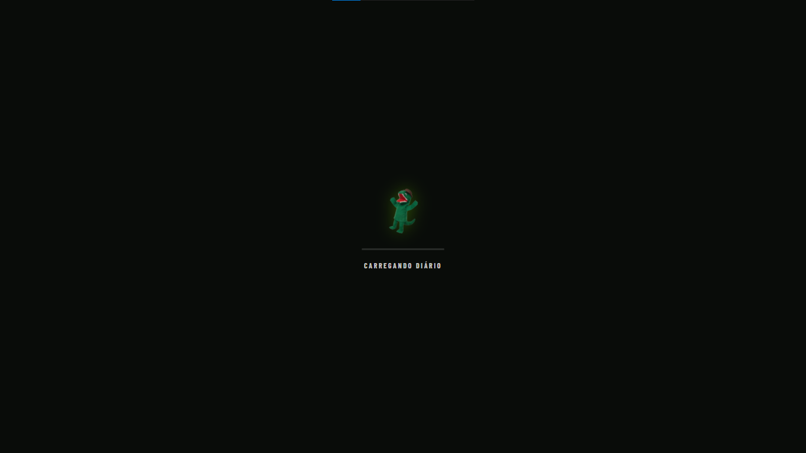

A cortina de carregamento impede que fontes, fundos e sprites apareçam progressivamente. Ela permanece visível por um intervalo mínimo e só libera a interface após a decodificação dos recursos críticos, o carregamento das fontes e a estabilização dos elementos visuais no DOM. Um limite de segurança evita bloqueio permanente em caso de falha de rede ou arquivo.

### 4.2 Autenticação por perfil

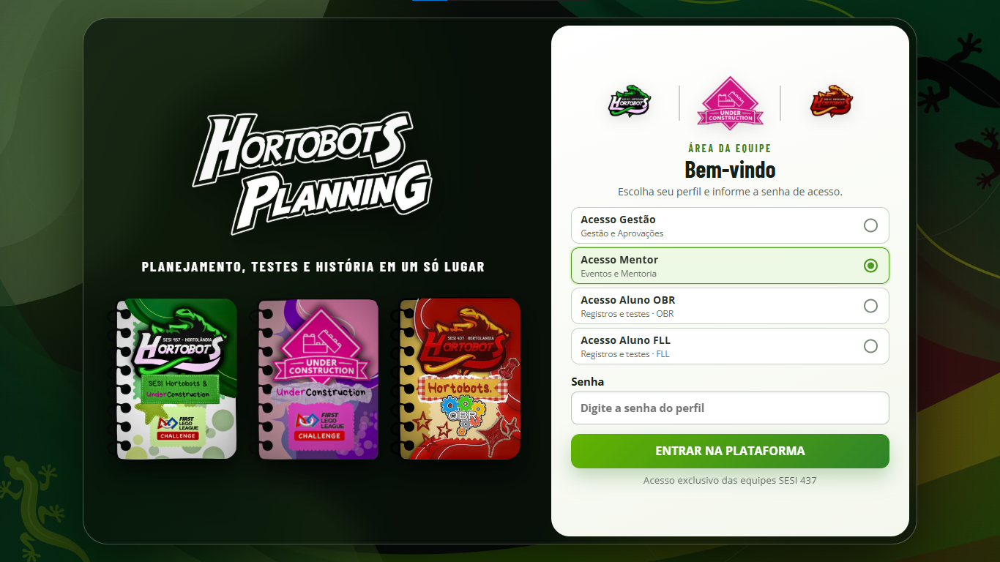

O usuário escolhe diretamente um dos quatro perfis fixos e informa a senha correspondente. Gestão acompanha e aprova; Mentor administra eventos e a mentoria; Aluno OBR registra apenas no caderno OBR; Aluno FLL registra nos cadernos FLL. A sessão autenticada controla as ações de criação, edição, exclusão e aprovação disponibilizadas pela interface.

### 4.3 Escolha do diário e atalhos de consulta

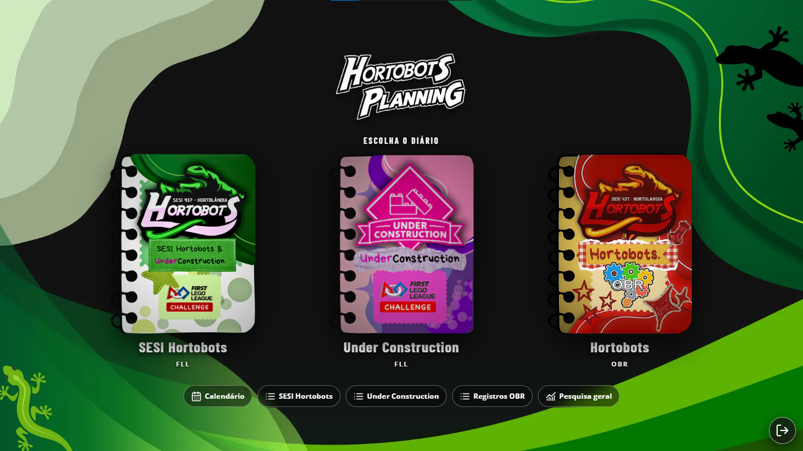

A home autenticada é o ponto fixo de retorno da plataforma. Nela o usuário abre um dos três cadernos e acessa os atalhos de consulta para calendário, registros por equipe e pesquisa geral. Cada caderno mantém rotas, identidade visual e dados de equipe próprios, mesmo quando compartilha os mesmos componentes de formulário.

### 4.4 SESI Hortobots FLL

#### Navegação do caderno

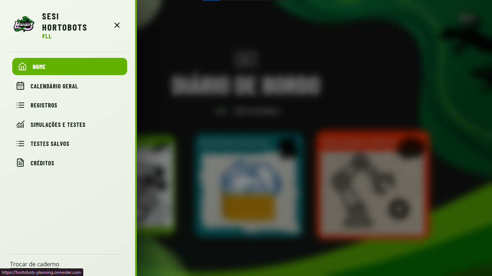

O menu lateral reúne home do caderno, calendário geral, registros, simulações, testes salvos e créditos. A abertura usa foco visual e desfoque do conteúdo ao fundo; a identidade verde e branca acompanha toda a sessão do SESI Hortobots FLL.

#### Página inicial do diário

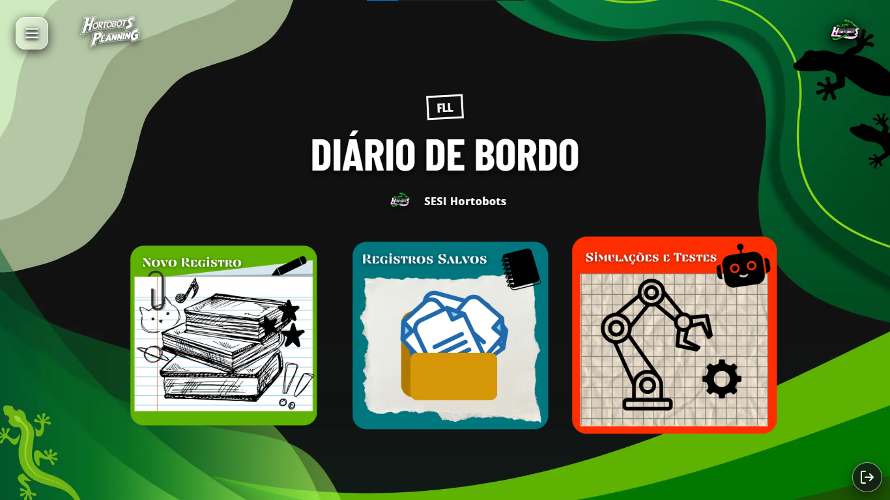

O painel oferece três ações centrais: criar um registro, consultar registros salvos e abrir simulações e testes. A marca da equipe e o fundo confirmam o contexto antes de qualquer lançamento.

#### Simulações FLL e missões da temporada

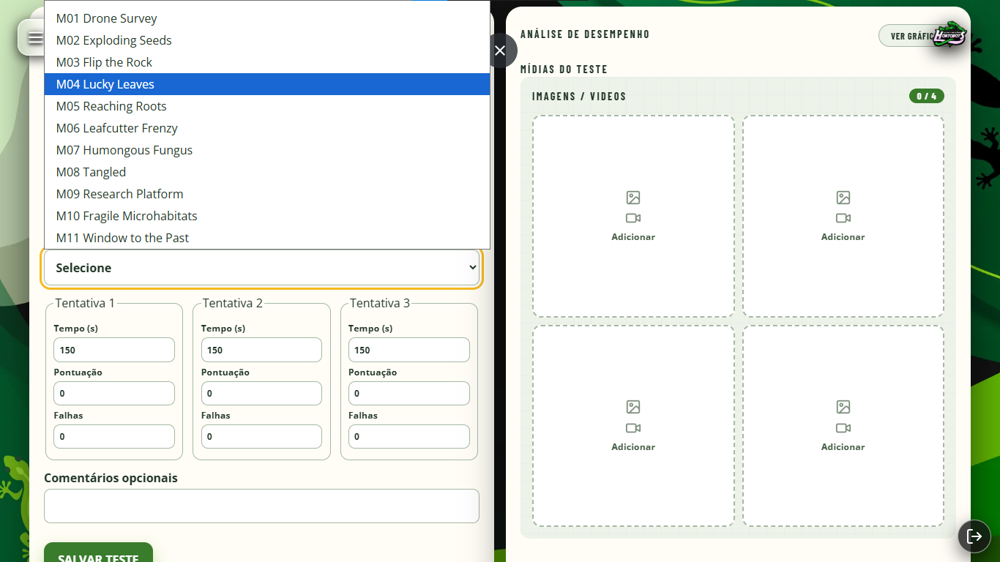

O formulário FLL registra de 3 a 15 tentativas, tempo, pontuação, falhas e missões oficiais realizadas. O painel complementar recebe até quatro imagens ou vídeos e gera análise gráfica em linha, barras ou formato circular antes do salvamento. Cada teste pode ser associado a registros do diário.

### 4.5 Under Construction FLL

#### Navegação do caderno

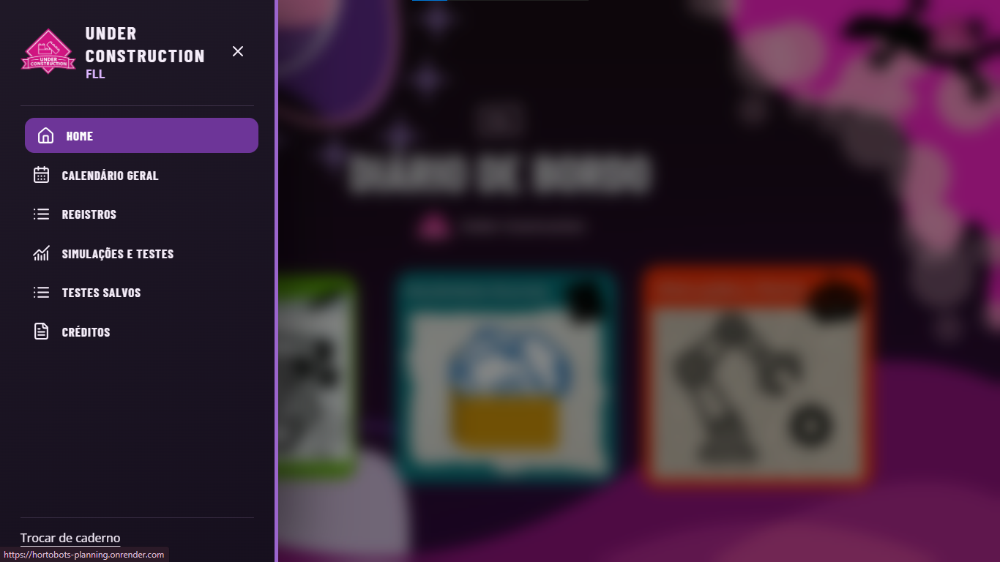

O terceiro caderno mantém a estrutura funcional da modalidade FLL, mas separa registros, testes e identidade da equipe Under Construction. Menu, realces e fundo usam roxo, rosa, preto e branco para impedir confusão com o SESI Hortobots.

#### Página inicial do diário

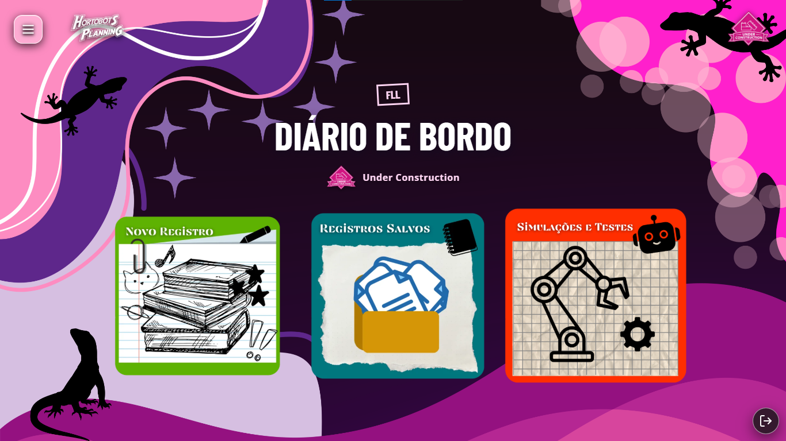

O hub da equipe disponibiliza novo registro, registros salvos e simulações e testes. As rotas usam a tag de equipe Under Construction, garantindo filtragem correta no calendário, no acervo e nas associações entre testes e relatórios.

#### Registros salvos da equipe

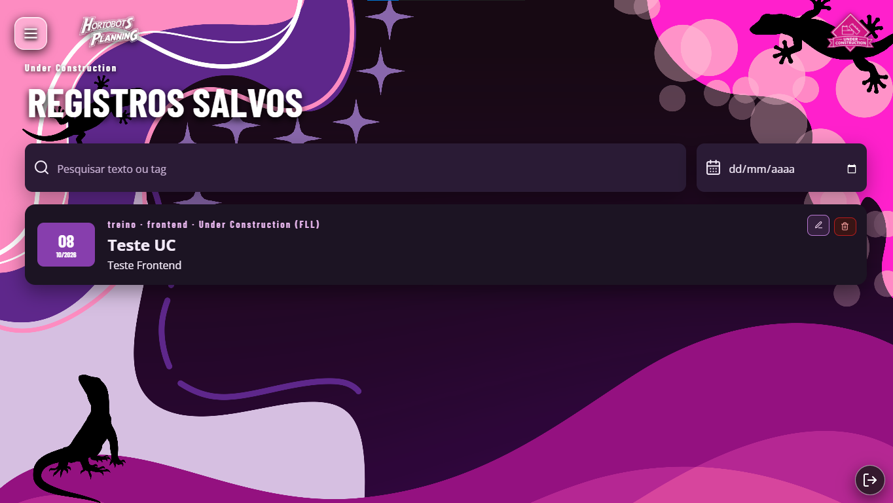

A listagem oferece pesquisa por texto ou tag e filtro por data. Cada cartão resume data, título, conteúdo e identidade da equipe; usuários autorizados recebem também ações de edição e exclusão.

### 4.6 Hortobots OBR

#### Navegação do caderno

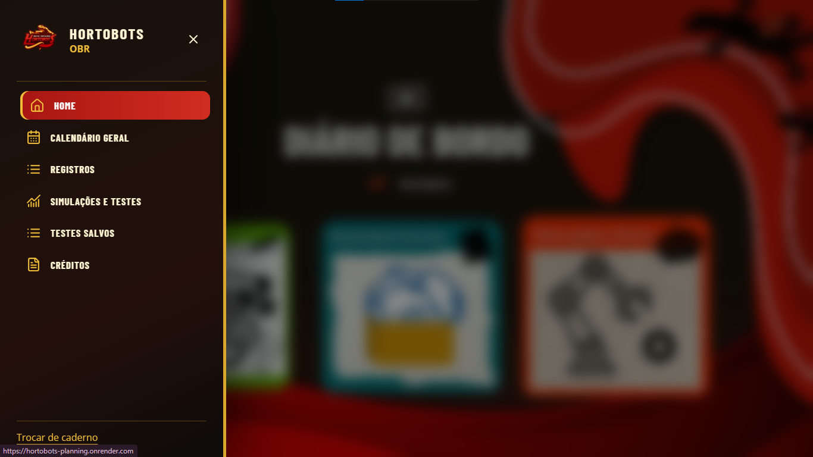

O menu OBR apresenta as mesmas áreas essenciais com identidade vermelha, dourada e preta. A separação de rota e modalidade impede que lançamentos da OBR sejam misturados aos dois cadernos FLL.

#### Página inicial do diário

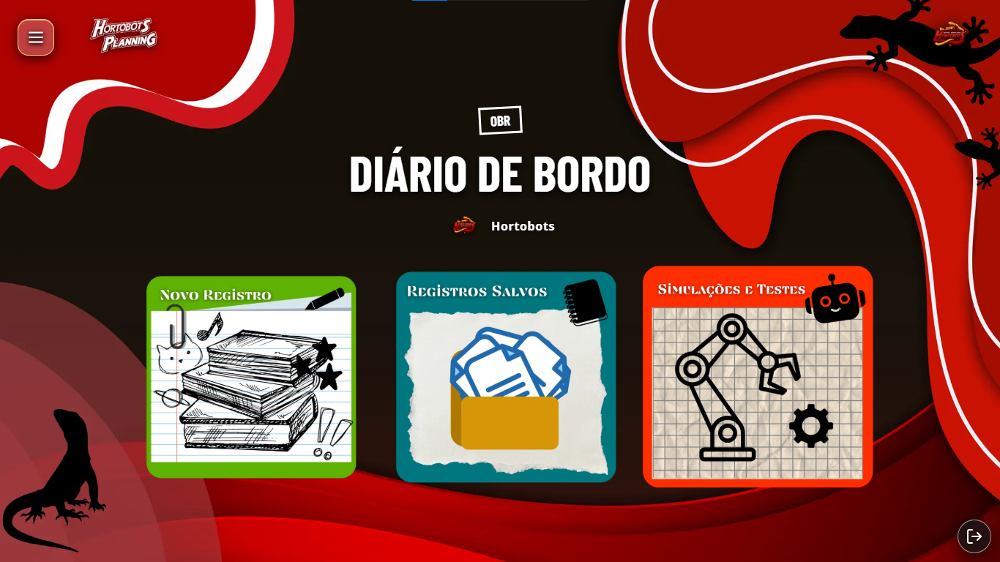

O painel centraliza novo registro, consulta do histórico e testes do robô. Logo, fundo e cores deixam evidente que todas as ações seguintes serão persistidas na modalidade OBR.

#### Simulações e testes OBR

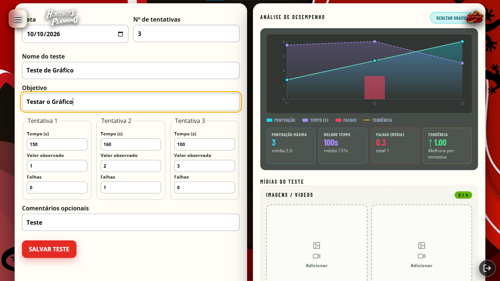

O teste OBR registra data, nome, objetivo e de 3 a 15 tentativas com tempo, valor observado e falhas. A análise mostra evolução, melhor tempo, média, falhas e tendência, além de aceitar fotos e vídeos. O gráfico pode ser ocultado para ampliar a área de preenchimento ou aberto em foco para inspeção.

### 4.7 Recursos compartilhados

#### Editor de registro

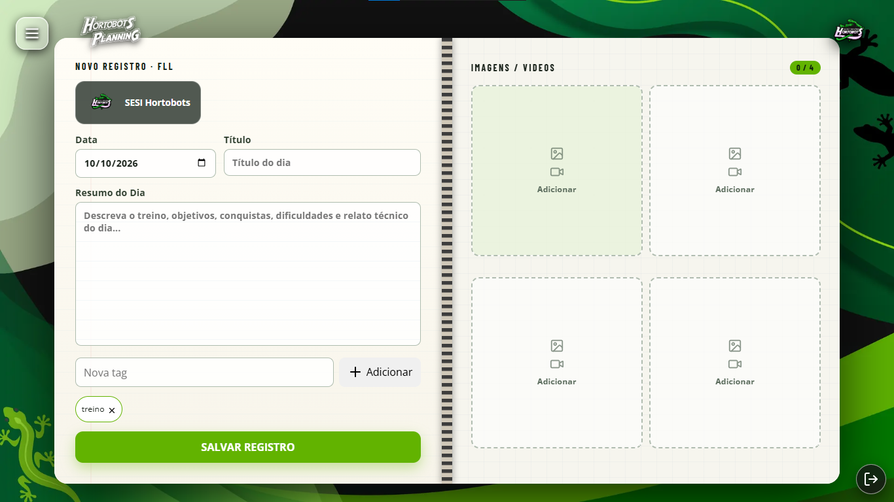

O caderno aberto divide o trabalho em duas páginas do mesmo tamanho. A primeira recebe equipe, data editável, título, resumo e tags personalizadas; a segunda organiza quatro áreas quadradas para imagens e vídeos. O conteúdo textual cresce apenas no eixo vertical e as mídias podem ser abertas em foco ou removidas com confirmação.

#### Calendário geral

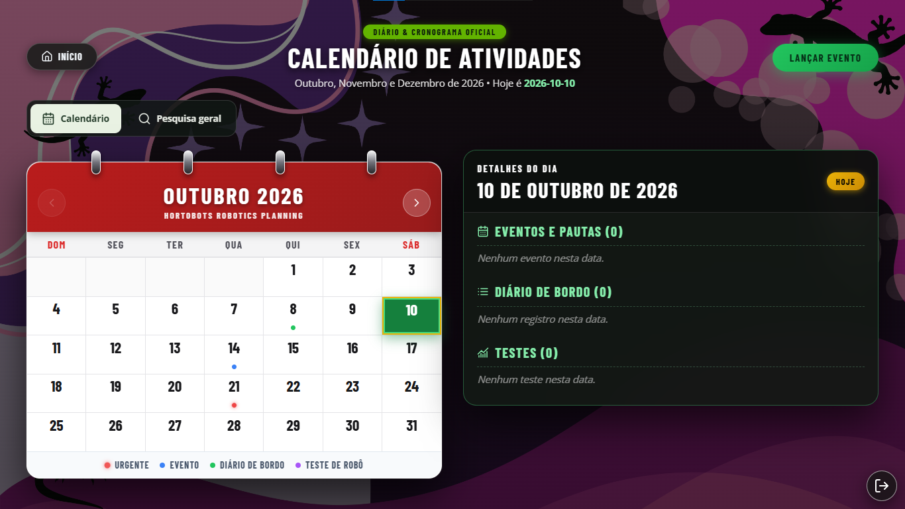

O calendário unifica eventos, registros e testes de todas as equipes. Marcadores por cor indicam o tipo de atividade e o painel do dia apresenta os itens selecionados. A visualização está disponível aos perfis autenticados; criação, edição e aprovação de eventos permanecem condicionadas às permissões da conta.

#### Lançamento de evento

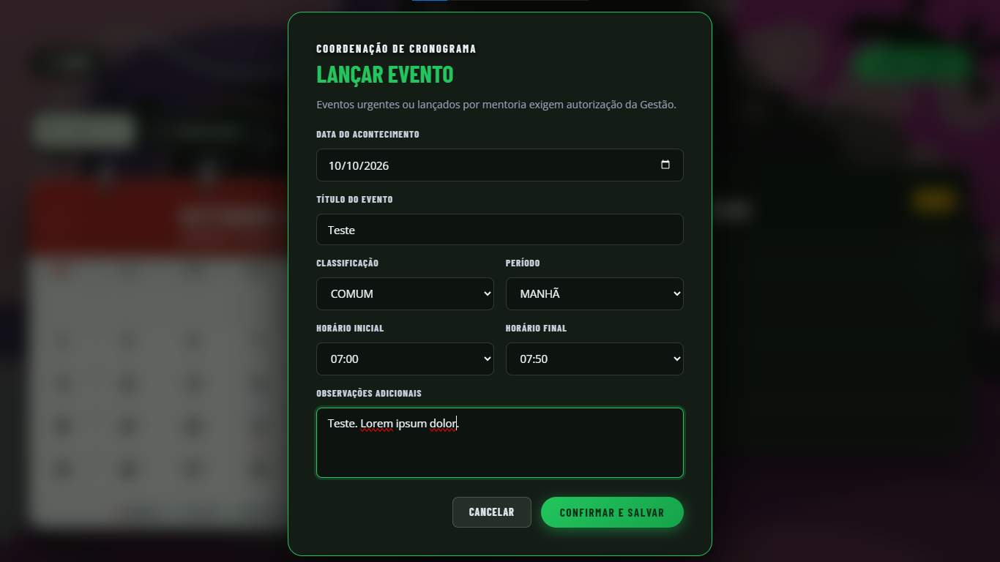

O modal de cronograma registra data, título, classificação comum ou urgente, período, horários por aula e observações. Eventos que exigem autorização ficam pendentes até a confirmação da Gestão, mantendo o planejamento separado dos registros técnicos.

#### Pesquisa geral do acervo

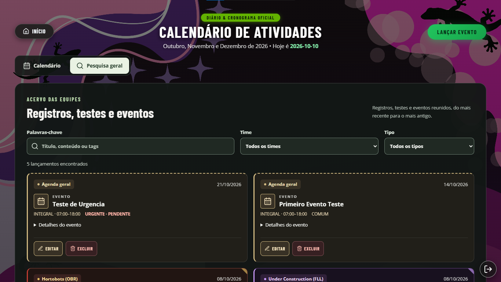

A guia reúne todo o acervo em ordem cronológica decrescente. A busca encontra título, conteúdo, tags, datas e nomes de mídia; os filtros por equipe e por tipo refinam os resultados. Os cartões preservam as cores de cada time e apresentam as ações permitidas ao perfil autenticado.

---

## 5. Guia de Instalacao e Execucao Local

### Pre-requisitos
- Node.js versao 20 ou superior.
- npm versao 10 ou superior.

### Instalacao de Dependencias
```bash
npm install
```

### Processamento de Assets Graficos (opcional / inicial)
```bash
npm run assets
```

### Execucao em Modo de Desenvolvimento Local (Logs)
Para executar a API em modo local (`Logs/`) em conjunto com o servidor Vite:
```bash
npm run dev:local
```
- Frontend acessivel em: `http://localhost:5173`
- Servidor de API acessivel em: `http://localhost:3000`

---

## 6. Comandos de Build e Validacao

### Compilacao Completa do Projeto
Gera os artefatos compilados em todos os workspaces (`shared`, `api` e `web`):
```bash
npm run build
```

### Compilacao por Workspace
```bash
# Pacote compartilhado
npm run build -w @hortobots/shared

# Backend Express
npm run build -w @hortobots/api

# Frontend React SPA
npm run build -w @hortobots/web
```

### Testes de Conformidade e Tipagem
```bash
# Validacao de regra sem emojis
npm run check:emoji

# Verificacao estrita de tipos TypeScript
npm run typecheck

# Analise estatica de codigo
npm run lint
```

---

## 7. Deploy e Producao

### Execucao da Versao de Producao Localmente
```bash
npm run build
npm run start:local
```
O servidor Express servira a aplicacao completa na porta 3000 (`http://localhost:3000`).

### Deploy no Render com Supabase
O arquivo `render.yaml` esta configurado para execucao no Render:
- **Build Command:** `npm ci && npm run check:emoji && npm run build`
- **Start Command:** `npm run start:render`
- **Health Check Path:** `/api/health`

### Variaveis de Ambiente Necessarias no Servidor
Configure as seguintes chaves no painel do Render ou arquivo `.env`:
```ini
NODE_VERSION=20
STORAGE_DRIVER=supabase
SUPABASE_URL=https://<seu-projeto>.supabase.co
SUPABASE_SERVICE_ROLE_KEY=<sua-service-role-key>
SUPABASE_BUCKET=hortobots-planning
PORT=3000
```

---

## 8. Padroes de Codigo e Boas Praticas

1. **TypeScript Estrito:**
   Configuracao com `strict: true` e `noUncheckedIndexedAccess`. Evita-se uso indiscriminado de `any`.
2. **Seguranca de Chaves:**
   Chaves privilegiadas (`service_role`) permanecem restritas ao backend. O cliente consome apenas a chave publica `anon`/`publishable`.
3. **Imutabilidade e Tratamento de Datas:**
   Datas de acontecimento sao manipuladas no formato textual `YYYY-MM-DD` preservando a data nominal sem interferencia indevida de fuso horario na persistencia.
4. **Resiliencia da API:**
   Uso de rate-limit contra abusos, sanitizacao de nomes de arquivos para evitar path traversal e protecao de rotas via tokens criptografados.
5. **Carregamento Visual Deterministico:**
   A cortina inicial aguarda `document.fonts.ready`, pré-carregamento e `HTMLImageElement.decode()` dos sprites críticos, duas passagens estáveis do DOM e um tempo mínimo de apresentação. Mudanças de rota usam o mesmo mecanismo com duração reduzida.
6. **Movimento e Compatibilidade:**
   Transições declaram propriedades específicas e priorizam `transform` e `opacity`. Quando o sistema solicita movimento reduzido, deslocamentos decorativos são removidos, mas feedbacks curtos de cor, sombra, foco e opacidade continuam suaves e perceptíveis.
